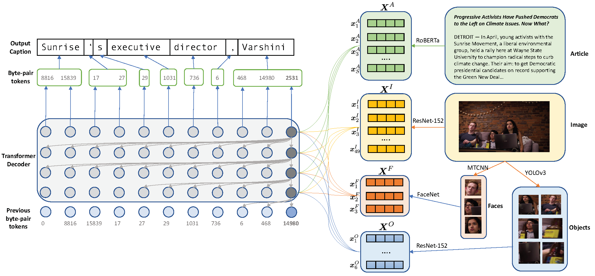

# Transform and Tell: Entity-Aware News Image Captioning



This repository contains the code to reproduce the results in our CVPR 2020
paper [Transform and Tell: Entity-Aware News Image
Captioning](https://arxiv.org/abs/2004.08070). We propose an end-to-end model
which generates captions for images embedded in news articles. News images
present two key challenges: they rely on real-world knowledge, especially about
named entities; and they typically have linguistically rich captions that
include uncommon words. We address the first challenge by associating words in
the caption with faces and objects in the image, via a multi-modal, multi-head
attention mechanism. We tackle the second challenge with a state-of-the-art
transformer language model that uses byte-pair-encoding to generate captions as
a sequence of word parts.

On the GoodNews dataset, our model outperforms the previous state of the art by
a factor of four in CIDEr score (13 to 54). This performance gain comes from a
unique combination of language models, word representation, image embeddings,
face embeddings, object embeddings, and improvements in neural network design.
We also introduce the NYTimes800k dataset which is 70% larger than GoodNews,
has higher article quality, and includes the locations of images within
articles as an additional contextual cue.

A live demo can be accessed [here](https://transform-and-tell.ml/). In the
demo, you can provide the URL to a New York Times article. The server will then
scrape the web page, extract the article and image, and feed them into our
model to generate a caption.

Please cite with the following BibTeX:

```raw
@InProceedings{Tran_2020_CVPR,
  author = {Tran, Alasdair and Mathews, Alexander and Xie, Lexing},
  title = {Transform and Tell: Entity-Aware News Image Captioning},
  booktitle = {IEEE/CVF Conference on Computer Vision and Pattern Recognition (CVPR)},
  month = {June},
  year = {2020}
}
```

## Requirements

```sh
# Install Anaconda for Python and then create a dedicated environment.
# This will make it easier to reproduce our experimental numbers.
conda env create -f environment.yml
conda activate tell

# This step is only needed if you want to use the Jupyter notebook
python -m ipykernel install --user --name tell --display-name "tell"

# Our Pytorch uses CUDA 10.2. Ensure that CUDA_HOME points to the right
# CUDA version. Chagne this depending on where you installed CUDA.
export CUDA_HOME=/usr/local/cuda-10.2

# We also pin the apex version, which is used for mixed precision training
cd libs/apex
git submodule init && git submodule update .
pip install -v --no-cache-dir --global-option="--pyprof" --global-option="--cpp_ext" --global-option="--cuda_ext" ./

# Install our package
cd ../.. && python setup.py develop

# Spacy is used to calcuate some of the evaluation metrics
spacy download en_core_web_lg

# We use nltk to tokenize the generated text to compute linguistic metrics
python -m nltk.downloader punkt
```

## Getting Data

The quickest way to get the data is to send an email to `first.last@anu.edu.au`
(where `first` is `alasdair` and `last` is `tran`) to request the MongoDB dump
that contains the dataset. Alternatively, see [here](docs/getting_data.md) for
instructions on how to get the data from scratch, which will take a few days.

Once we have obtained the data from the authors, which consists of two
directories `expt` and `data`, you can simply put them at the root of this
repo.

```sh
# If the data is download from our Cloudstor server, then you might need
# to first unzip the archives using either tar or 7z.

# First, let's start an empty local MongoDB server on port 27017. Below
# we set the cache size to 10GB of RAM. Change it depending on your system.
mkdir data/mongodb
mongod --bind_ip_all --dbpath data/mongodb --wiredTigerCacheSizeGB 10

# Next let's restore the NYTimes200k and GoodNews datasets
mongorestore --db nytimes --host=localhost --port=27017 --drop --gzip --archive=data/mongobackups/nytimes-2020-04-21.gz
mongorestore --db goodnews --host=localhost --port=27017 --drop --gzip --archive=data/mongobackups/goodnews-2020-04-21.gz

# Next we unarchive the image directories. For each dataset, you can see two
# directories: `images` and `images_processed`. The files in `images` are
# the orignal files scraped from the New York Times. You only need this
# if you want to recompute the face and object embeddings. Otherwise, all
# the experiments will use the images in `images_processed`, which have
# already been cropped and resized.
tar -zxf data/nytimes/images_processed.tar.gz -C data/nytimes/
tar -zxf data/goodnews/images_processed.tar.gz -C data/goodnews/

# We are now ready to train the models!
```

You can see an example of how we read the NYTimes800k samples from the MongoDB
database [here](tell/data/dataset_readers/nytimes_faces_ner_matched.py).
Here's a minimum working example in Python:

```python
import os
from PIL import Image
from pymongo import MongoClient

# Assume that you've already restored the database and the mongo server is running
client = MongoClient(host='localhost', port=27017)

# All of our NYTimes800k articles sit in the database `nytimes`
db = client.nytimes

# Here we select a random article in the training set.
article = db.articles.find_one({'split': 'train'})

# You can visit the original web page where this article came from
url = article['web_url']

# Each article contains a lot of fields. If you want the title, then
title = article['headline']['main'].strip()

# If you want the article text, then you will need to manually merge all
# paragraphs together.
sections = article['parsed_section']
paragraphs = []
for section in sections:
    if section['type'] == 'paragraph':
        paragraphs.append(section['text'])
article_text = '\n'.join(paragraphs)

# To get the caption of the first image in the article
pos = article['image_positions'][0]
caption = sections[pos]['text'].strip()

# If you want to load the actual image into memory
image_dir = 'data/nytimes/images_processed' # change this accordingly
image_path = os.path.join(image_dir, f"{sections[pos]['hash']}.jpg")
image = Image.open(image_path)

# You can also load the pre-computed FaceNet embeddings of the faces in the image
facenet_embeds = sections[pos]['facenet_details']['embeddings']

# Object embeddings are stored in a separate collection due to a size limit in mongo
obj = db.objects.find_one({'_id': sections[pos]['hash']})
object_embeds = obj['object_features']
```

## Training and Evaluation

```sh
# Train the full model on NYTimes800k. This takes around 4 days on a Titan V GPU.
# The training will populate the directory expt/nytimes/9_transformer_objects/serialization
CUDA_VISIBLE_DEVICES=0 tell train expt/nytimes/9_transformer_objects/config.yaml -f

# Once training is finished, the best model weights are stored in
#   expt/nytimes/9_transformer_objects/serialization/best.th
# We can use this to generate captions on the NYTimes800k test set. This
# takes about one hour.
CUDA_VISIBLE_DEVICES=0 tell evaluate expt/nytimes/9_transformer_objects/config.yaml -m expt/nytimes/9_transformer_objects/serialization/best.th

# Compute the evaluation metrics on the test set
python scripts/compute_metrics.py -c data/nytimes/name_counters.pkl expt/nytimes/9_transformer_objects/serialization/generations.jsonl
```

There are also other model variants which are ablation studies. Check
our paper for more details, but here's a summary:

| Experiment                       | Word Embedding | Language Model | Image Attention | Weighted RoBERTa | Location-Aware | Face Attention | Object Attention |
| -------------------------------- | :------------: | -------------: | --------------: | ---------------: | -------------: | -------------: | ---------------: |
| `1_lstm_glove`                   |     GloVe      |           LSTM |               ✔ |                  |                |                |                  |
| `2_transformer_glove`            |     GloVe      |    Transformer |               ✔ |                  |                |                |                  |
| `3_lstm_roberta`                 |    RoBERTa     |           LSTM |               ✔ |                  |                |                |                  |
| `4_no_image`                     |    RoBERTa     |    Transformer |                 |                  |                |                |                  |
| `5_transformer_roberta`          |    RoBERTa     |    Transformer |               ✔ |                  |                |                |                  |
| `6_transformer_weighted_roberta` |    RoBERTa     |    Transformer |               ✔ |                ✔ |                |                |                  |
| `7_trasnformer_location_aware`   |    RoBERTa     |    Transformer |               ✔ |                ✔ |              ✔ |                |                  |
| `8_transformer_faces`            |    RoBERTa     |    Transformer |               ✔ |                ✔ |              ✔ |              ✔ |                  |
| `9_transformer_objects`          |    RoBERTa     |    Transformer |               ✔ |                ✔ |              ✔ |              ✔ |                ✔ |

## Acknowledgement

- The training and evaluation workflow is based on the
  [AllenNLP](https://github.com/allenai/allennlp) framework.

- The Dynamic Convolution architecture is built upon Facebook's
  [fairseq](https://github.com/pytorch/fairseq/blob/master/examples/pay_less_attention_paper/README.md)
  library.

- The ZeroMQ implementation of the demo backend server is based on
  [bert-as-service](https://github.com/hanxiao/bert-as-service).

- The front-end of the demo server is created with
  [create-react-app](https://github.com/facebook/create-react-app)

- ResNet code is adapted from the [Pytorch
  implementation](https://github.com/pytorch/vision/blob/master/torchvision/models/resnet.py).

- We use Ultralytics' [YOLOv3 implementation](https://github.com/ultralytics/yolov3).

- FaceNet and MTCNN implementations come from [here](https://github.com/timesler/facenet-pytorch).
